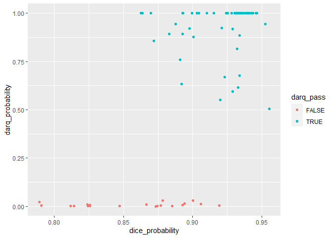
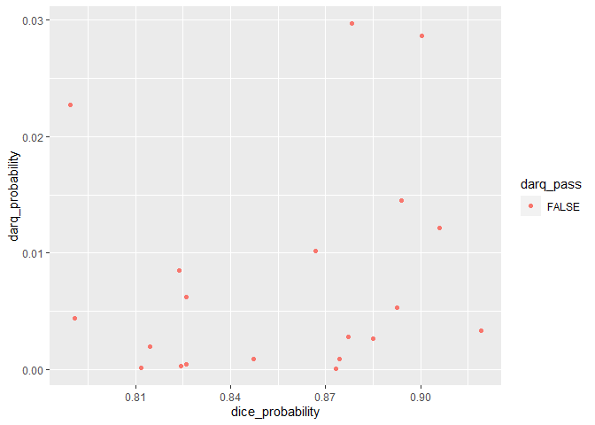

Clinica QC metrics visualization
================

``` r
suppressMessages(library(ggplot2))
```

    ## Warning: package 'ggplot2' was built under R version 4.1.3

``` r
suppressMessages(library(tidyverse))
```

    ## Warning: package 'tidyr' was built under R version 4.1.3

    ## Warning: package 'readr' was built under R version 4.1.3

    ## Warning: package 'purrr' was built under R version 4.1.3

    ## Warning: package 'dplyr' was built under R version 4.1.3

    ## Warning: package 'stringr' was built under R version 4.1.3

    ## Warning: package 'forcats' was built under R version 4.1.3

``` r
suppressMessages(library(readr))
```

## Read data

``` r
data.path <- "../data/"
oasis_dice <- read_tsv(paste0(data.path, "oasis_dice.tsv"))
```

    ## New names:
    ## Rows: 78 Columns: 6
    ## -- Column specification
    ## -------------------------------------------------------- Delimiter: "\t" chr
    ## (2): participant_id, session_id dbl (3): ...1, dice_probability,
    ## darq_probability lgl (1): darq_pass
    ## i Use `spec()` to retrieve the full column specification for this data. i
    ## Specify the column types or set `show_col_types = FALSE` to quiet this message.
    ## * `` -> `...1`

``` r
head(oasis_dice)
```

    ## # A tibble: 6 x 6
    ##    ...1 participant_id session_id dice_probability darq_probability darq_pass
    ##   <dbl> <chr>          <chr>                 <dbl>            <dbl> <lgl>    
    ## 1     0 sub-OASIS10002 ses-M00               0.893         0.892    TRUE     
    ## 2     1 sub-OASIS10010 ses-M00               0.812         0.000141 FALSE    
    ## 3     2 sub-OASIS10011 ses-M00               0.931         1.00     TRUE     
    ## 4     3 sub-OASIS10037 ses-M00               0.923         0.670    TRUE     
    ## 5     4 sub-OASIS10042 ses-M00               0.893         1.00     TRUE     
    ## 6     5 sub-OASIS10045 ses-M00               0.952         0.945    TRUE

## Visualize

### scatter plot - all

``` r
ggplot(oasis_dice, 
       aes(x = dice_probability, y = darq_probability, color = darq_pass)) +
  geom_point()
```

<!-- -->

### scatter plot - failed

``` r
oasis_dice %>% filter(darq_pass == "FALSE") %>% ggplot(aes(x = dice_probability, y = darq_probability, color = darq_pass)) +
  geom_point()
```

<!-- -->
