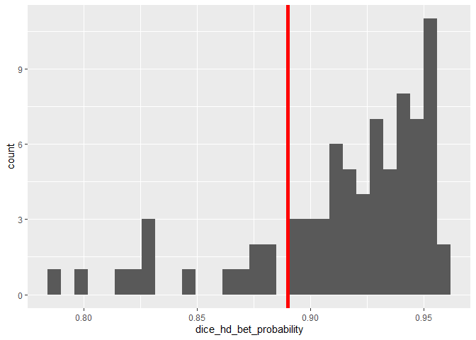
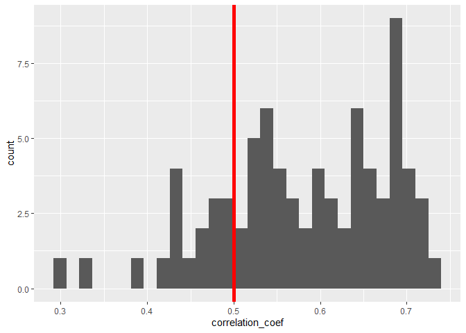
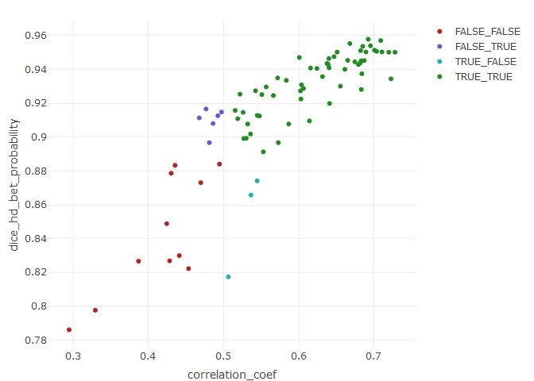

Clinica full QC metrics visualization
================
Ju-Chi.Yu
2023-07-20

## Read data

``` r
head(oasis_dice)
```

    ## # A tibble: 6 x 12
    ##    ...1 partic~1 sessi~2 dice_~3 darq_~4 darq_~5 dice_~6 mutua~7 corre~8 norm_mi
    ##   <dbl> <chr>    <chr>     <dbl>   <dbl> <lgl>     <dbl>   <dbl>   <dbl>   <dbl>
    ## 1     0 sub-OAS~ ses-M00   0.893 8.92e-1 TRUE      0.910   0.853   0.785   0.201
    ## 2     1 sub-OAS~ ses-M00   0.812 1.41e-4 FALSE     0.830   0.725   0.677   0.174
    ## 3     2 sub-OAS~ ses-M00   0.931 1.00e+0 TRUE      0.941   0.873   0.816   0.207
    ## 4     3 sub-OAS~ ses-M00   0.923 6.70e-1 TRUE      0.913   0.761   0.715   0.182
    ## 5     4 sub-OAS~ ses-M00   0.893 1.00e+0 TRUE      0.923   0.715   0.727   0.176
    ## 6     5 sub-OAS~ ses-M00   0.952 9.45e-1 TRUE      0.941   0.798   0.779   0.194
    ## # ... with 2 more variables: correlation_coef <dbl>, cr_l1 <dbl>, and
    ## #   abbreviated variable names 1: participant_id, 2: session_id,
    ## #   3: dice_bet_probability, 4: darq_probability, 5: darq_pass,
    ## #   6: dice_hd_bet_probability, 7: mutual_info, 8: correlation_ratio

## Scatter plot

### dice BET

The correlation between the two metrics is 0.6859204

<!-- -->

### dice HD-BET

The correlation between the two metrics is 0.7552805

<!-- -->
\### Mutual information

The correlation between the two metrics is 0.5150382

<!-- -->

### Correlation ratio

The correlation between the two metrics is 0.7392367

<!-- -->

### Norm mi

The correlation between the two metrics is 0.6330968

<!-- -->

### Correlation coefficient

The correlation between the two metrics is 0.7570659

<!-- -->

### L1-norm correlation coefficient

The correlation between the two metrics is 0.7549297

<!-- -->

## Correlation plot

``` r
corrplot::corrplot(cor(oasis_dice_num), method = "shade", order = "hclust", hclust.method = "ward.D2")
```

<!-- -->

## Explore

What if we only look at dice?

### Clustering results

### Density plot

``` r
oasis_dice_num %>% pivot_longer(colnames(oasis_dice_num)) %>%
ggplot(aes(x = value)) + geom_histogram(bins = 25) + facet_wrap(~name)
```

<!-- -->

### PCA

``` r
## Plot factor scores
fi.map <- createFactorMap(PCAres$ExPosition.Data$fi,
                          col.points = color.ind.all,
                          alpha.points = 0.3,
                          col.background = NULL,
                          col.axes = "black")

fi.map$zeMap_background + fi.map$zeMap_dots + map.label
```

<!-- -->

``` r
## Column factor scores
fj.map <- createFactorMap(PCAres$ExPosition.Data$fj,
                          col.background = NULL,
                          col.axes = "black")

fj.arrow <- addArrows(PCAres$ExPosition.Data$fj)

fj.map$zeMap + fj.arrow + map.label
```

<!-- -->

If we narrow it down to a subset, we would choose
`dice_hd_bet_probability` and `correlation_coef`.

### Grouping with the two metrics

#### Distributions

We first check the distribution of the two metrics

``` r
FinMetric <- oasis_dice %>% select(dice_hd_bet_probability, correlation_coef) %>% as.data.frame
rownames(FinMetric) <- oasis_dice$participant_id

FinMetric %>% ggplot(aes(dice_hd_bet_probability)) + geom_histogram(bins = 30) + geom_vline(xintercept = 0.89, color = "red", lwd = 2)
```

    ## Warning: Using `size` aesthetic for lines was deprecated in ggplot2 3.4.0.
    ## i Please use `linewidth` instead.

<!-- -->

``` r
FinMetric %>% ggplot(aes(correlation_coef)) + geom_histogram(bins = 30) + geom_vline(xintercept = 0.5, color = "red", lwd = 2)
```

<!-- -->

#### scatter plot

The correlation between the two metrics is 0.8652564

- The group labels are in <Pass/Fail_corr_coef>\_<Pass/Fail_dice_hd_bet>

<!-- -->

    ## Warning: package 'plotly' was built under R version 4.1.3

    ## 
    ## Attaching package: 'plotly'

    ## The following object is masked from 'package:ggplot2':
    ## 
    ##     last_plot

    ## The following object is masked from 'package:stats':
    ## 
    ##     filter

    ## The following object is masked from 'package:graphics':
    ## 
    ##     layout

    ## No trace type specified:
    ##   Based on info supplied, a 'scatter' trace seems appropriate.
    ##   Read more about this trace type -> https://plotly.com/r/reference/#scatter

    ## No scatter mode specifed:
    ##   Setting the mode to markers
    ##   Read more about this attribute -> https://plotly.com/r/reference/#scatter-mode

<!-- -->
\#### Participants in 4 groups {.tabset}

##### Pass Both

``` r
FinMetric %>% filter(both_group == "TRUE_TRUE") %>% rownames
```

    ##  [1] "sub-OASIS10002" "sub-OASIS10011" "sub-OASIS10037" "sub-OASIS10042"
    ##  [5] "sub-OASIS10045" "sub-OASIS10051" "sub-OASIS10060" "sub-OASIS10062"
    ##  [9] "sub-OASIS10063" "sub-OASIS10071" "sub-OASIS10081" "sub-OASIS10103"
    ## [13] "sub-OASIS10112" "sub-OASIS10117" "sub-OASIS10126" "sub-OASIS10136"
    ## [17] "sub-OASIS10142" "sub-OASIS10150" "sub-OASIS10151" "sub-OASIS10156"
    ## [21] "sub-OASIS10167" "sub-OASIS10183" "sub-OASIS10184" "sub-OASIS10185"
    ## [25] "sub-OASIS10195" "sub-OASIS10207" "sub-OASIS10218" "sub-OASIS10260"
    ## [29] "sub-OASIS10261" "sub-OASIS10266" "sub-OASIS10280" "sub-OASIS10287"
    ## [33] "sub-OASIS10294" "sub-OASIS10303" "sub-OASIS10309" "sub-OASIS10310"
    ## [37] "sub-OASIS10316" "sub-OASIS10318" "sub-OASIS10323" "sub-OASIS10329"
    ## [41] "sub-OASIS10333" "sub-OASIS10342" "sub-OASIS10348" "sub-OASIS10357"
    ## [45] "sub-OASIS10363" "sub-OASIS10380" "sub-OASIS10388" "sub-OASIS10396"
    ## [49] "sub-OASIS10406" "sub-OASIS10413" "sub-OASIS10415" "sub-OASIS10420"
    ## [53] "sub-OASIS10423" "sub-OASIS10430" "sub-OASIS10432" "sub-OASIS10435"
    ## [57] "sub-OASIS10439" "sub-OASIS10446"

##### Fail Both

``` r
FinMetric %>% filter(both_group == "FALSE_FALSE") %>% rownames
```

    ##  [1] "sub-OASIS10010" "sub-OASIS10110" "sub-OASIS10162" "sub-OASIS10179"
    ##  [5] "sub-OASIS10199" "sub-OASIS10222" "sub-OASIS10223" "sub-OASIS10227"
    ##  [9] "sub-OASIS10373" "sub-OASIS10398" "sub-OASIS10400"

##### Pass Corr_coef Fail dice_hd_bet

``` r
FinMetric %>% filter(both_group == "TRUE_FALSE") %>% rownames
```

    ## [1] "sub-OASIS10114" "sub-OASIS10291" "sub-OASIS10377"

##### Fail Corr_coef Pass dice_hd_bet

``` r
FinMetric %>% filter(both_group == "FALSE_TRUE") %>% rownames
```

    ## [1] "sub-OASIS10084" "sub-OASIS10155" "sub-OASIS10180" "sub-OASIS10371"
    ## [5] "sub-OASIS10372" "sub-OASIS10402"
