Clinica full QC metrics visualization
================
Ju-Chi.Yu
2023-07-20

## Read data

``` r
head(oasis_dice)
```

    ## # A tibble: 6 x 12
    ##    ...1 partic~1 sessi~2 dice_~3 darq_~4 darq_~5 dice_~6 mutua~7 corre~8 norm_mi
    ##   <dbl> <chr>    <chr>     <dbl>   <dbl> <lgl>     <dbl>   <dbl>   <dbl>   <dbl>
    ## 1     0 sub-OAS~ ses-M00   0.893 8.92e-1 TRUE      0.910   0.853   0.785   0.201
    ## 2     1 sub-OAS~ ses-M00   0.812 1.41e-4 FALSE     0.830   0.725   0.677   0.174
    ## 3     2 sub-OAS~ ses-M00   0.931 1.00e+0 TRUE      0.941   0.873   0.816   0.207
    ## 4     3 sub-OAS~ ses-M00   0.923 6.70e-1 TRUE      0.913   0.761   0.715   0.182
    ## 5     4 sub-OAS~ ses-M00   0.893 1.00e+0 TRUE      0.923   0.715   0.727   0.176
    ## 6     5 sub-OAS~ ses-M00   0.952 9.45e-1 TRUE      0.941   0.798   0.779   0.194
    ## # ... with 2 more variables: correlation_coef <dbl>, cr_l1 <dbl>, and
    ## #   abbreviated variable names 1: participant_id, 2: session_id,
    ## #   3: dice_bet_probability, 4: darq_probability, 5: darq_pass,
    ## #   6: dice_hd_bet_probability, 7: mutual_info, 8: correlation_ratio

## Scatter plot

### dice BET

The correlation between the two metrics is 0.6859204

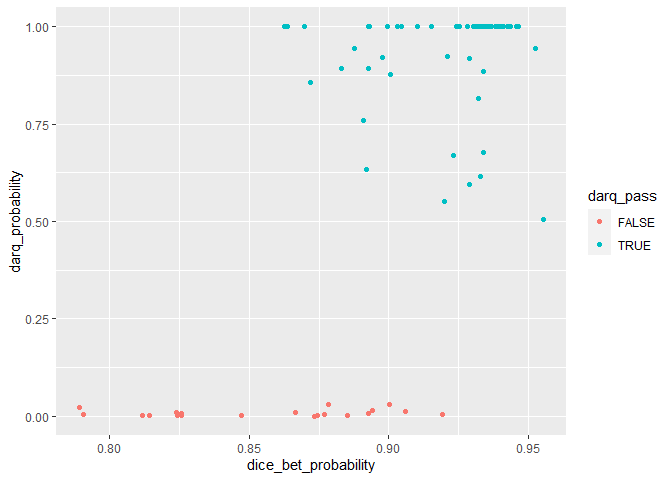<!-- -->

### dice HD-BET

The correlation between the two metrics is 0.7552805

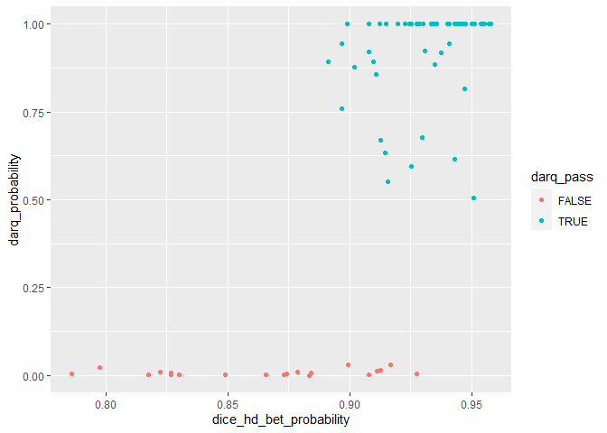<!-- -->
\### Mutual information

The correlation between the two metrics is 0.5150382

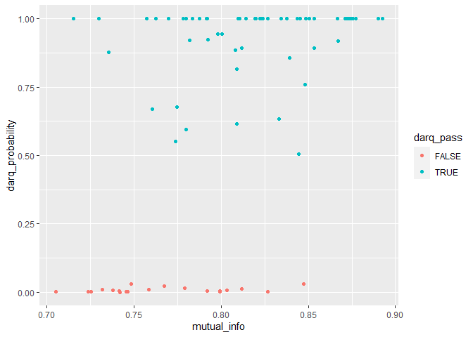<!-- -->

### Correlation ratio

The correlation between the two metrics is 0.7392367

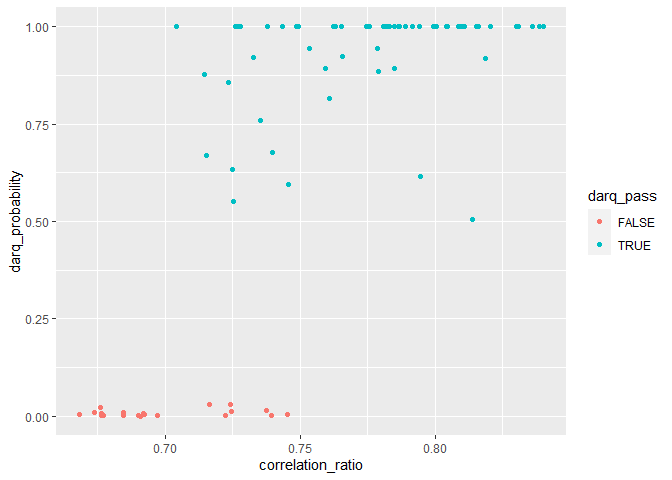<!-- -->

### Norm mi

The correlation between the two metrics is 0.6330968

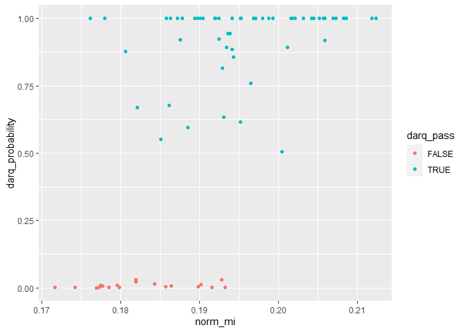<!-- -->

### Correlation coefficient

The correlation between the two metrics is 0.7570659

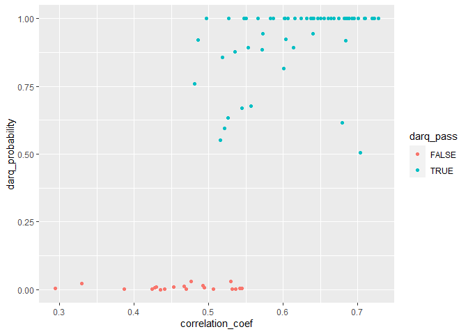<!-- -->

### L1-norm correlation coefficient

The correlation between the two metrics is 0.7549297

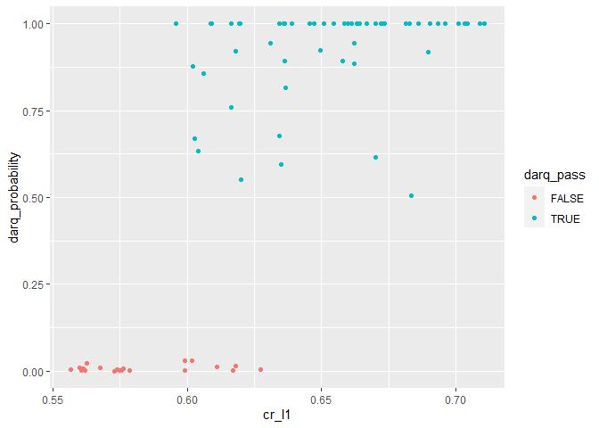<!-- -->

## Correlation plot

``` r
corrplot::corrplot(cor(oasis_dice_num), method = "shade", order = "hclust", hclust.method = "ward.D2")
```

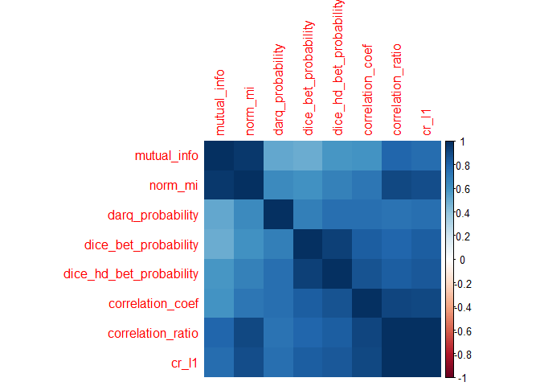<!-- -->

## Explore

What if we only look at dice?

### Clustering results

### Density plot

``` r
oasis_dice_num %>% pivot_longer(colnames(oasis_dice_num)) %>%
ggplot(aes(x = value)) + geom_histogram(bins = 25) + facet_wrap(~name)
```

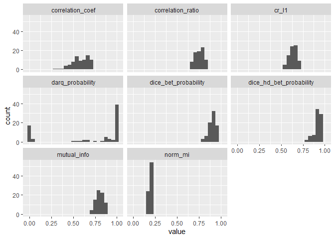<!-- -->

### PCA

``` r
## Plot factor scores
fi.map <- createFactorMap(PCAres$ExPosition.Data$fi,
                          col.points = color.ind.all,
                          alpha.points = 0.3,
                          col.background = NULL,
                          col.axes = "black")

fi.map$zeMap_background + fi.map$zeMap_dots + map.label
```

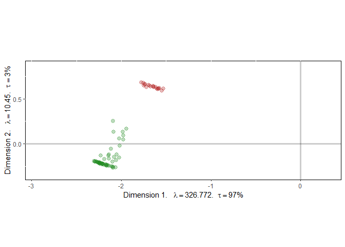<!-- -->

``` r
## Column factor scores
fj.map <- createFactorMap(PCAres$ExPosition.Data$fj,
                          col.background = NULL,
                          col.axes = "black")

fj.arrow <- addArrows(PCAres$ExPosition.Data$fj)

fj.map$zeMap + fj.arrow + map.label
```

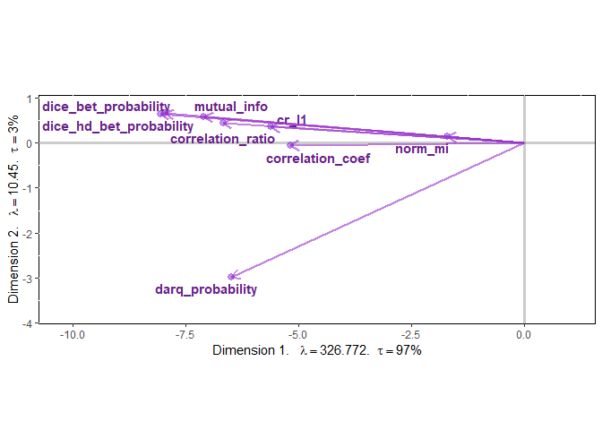<!-- -->

If we narrow it down to a subset, we would choose
`dice_hd_bet_probability`, `cr_l1`, `correlation_ratio`, and `norm_mi`
